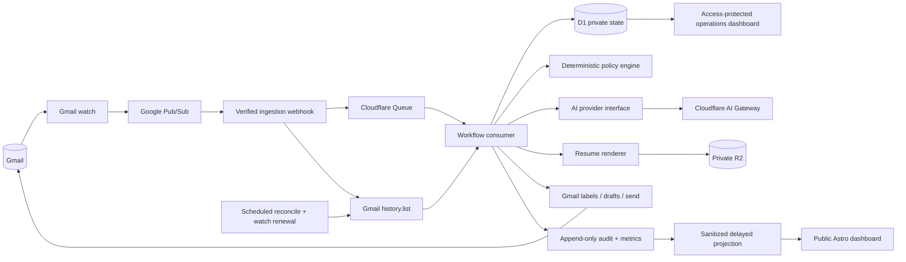
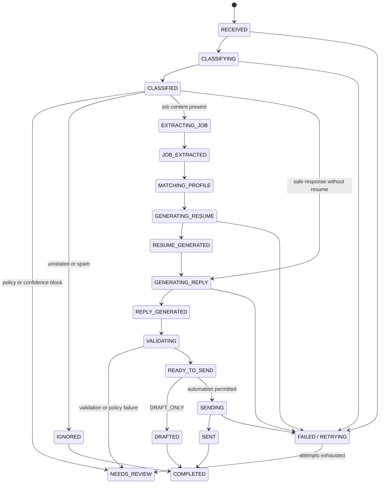

# AI Career Automation Platform

Status: target architecture, current-state assessment, and Phase 0 safety foundation
Last reviewed: August 21, 2026
Implementation branch: `feature/job-application-assistant`

## Executive decision

Evolve the existing Astro portfolio and Cloudflare Worker incrementally. Do not rewrite the portfolio and do not split the application into decorative microservices.

The target is one modular Cloudflare application with:

- Gmail push notifications through Google Pub/Sub as the primary trigger;
- Gmail `history.list` as the incremental source of truth;
- a scheduled reconciliation and `watch` renewal fallback;
- Cloudflare Queues for bounded asynchronous work, retry delay, and dead-letter handling;
- D1 as the workflow, policy, audit, and sanitized-telemetry authority;
- private R2 for generated artifacts;
- deterministic policy enforcement around interchangeable AI providers;
- Cloudflare Access for every private operation;
- a static Astro public experience that reads only delayed, sanitized projections.

This architecture fits a personal-mailbox workload while demonstrating real event processing, safety boundaries, reliability, testing, and observability. Durable Objects, multiple deployable services, Kafka, and a separate frontend framework are not justified at this scale.

## Requirements and constraints

### Functional requirements

- Ingest new Gmail changes without scanning the entire mailbox.
- Classify recruiting mail into an extensible domain taxonomy.
- Extract job requirements into validated structured data.
- Route each message through deterministic automation policy.
- Generate truthful resumes and professional replies through a provider-neutral AI boundary.
- Automatically send only explicitly permitted, low-risk responses.
- Label interview, offer, onboarding, negotiation, ambiguous, and policy-blocked mail for private review.
- Publish sanitized aggregates, health, and generalized activity to the portfolio.
- Provide an authenticated private operating surface for review, configuration, recovery, and the kill switch.

### Non-functional requirements

- Personal scale: normally tens of relevant messages per day, with hostile input still assumed.
- Near-real-time target: event accepted within seconds and ordinary workflows completed within two minutes, excluding provider outages.
- At-least-once delivery with idempotent side effects. “Exactly once” is not claimed across Gmail, Pub/Sub, Queues, D1, R2, and AI providers.
- No live Gmail, AI, or Cloudflare dependency in normal CI.
- No raw email content, prompts, generated replies, recruiter identity, or artifacts in public telemetry.
- Automatic sending must stop immediately when the effective automation mode forbids it.

## Current-state assessment

| Area | Status | Evidence and assessment |
| --- | --- | --- |
| Portfolio | Implemented | Astro 7 static output, semantic routes, modern CSS, progressive enhancement, responsive and accessibility tests |
| Public system story | Implemented | `/assistant/` provides a sanitized dashboard and data-driven pipeline topology with honest live/unavailable states and no owner controls or synthetic production totals |
| Privileged runtime isolation | Implemented | A separate Cloudflare Worker owns Gmail, AI Gateway, D1, R2, Browser Rendering, and private routes |
| OAuth and secrets | Implemented | Gmail uses OAuth; refresh tokens are AES-GCM encrypted in D1; Worker secrets and AI Gateway BYOK are documented |
| Idempotency | Partially implemented | Unique mailbox/message key, D1 lease, stable reply `Message-ID`, Sent reconciliation, and idempotent Sheet mirror exist |
| Workflow lifecycle | Partially implemented | Durable stages exist, but analysis, extraction, policy, reply generation, and validation are collapsed into coarse statuses |
| Classification | Partially implemented | OpenAI Structured Outputs and confidence exist, but the taxonomy and decision fields are too narrow |
| Career truth | Partially implemented | Public canonical experience and skill allowlisting prevent invented resume bullets; private answers/preferences are missing |
| Resume generation | Partially implemented | Verified PDF generation and private R2 storage exist; provenance, version, usage, cost, checksum, DOCX, and validation records are missing |
| Manual review | Phase 0 implemented in code | High-impact, sensitive, low-confidence, sender-uncertain, oversized, and exhausted-retry messages route to a private review record and Gmail `AI-Career/Needs-Attention` label while retaining `INBOX`; owner UI remains pending |
| Automation controls | Phase 0 implemented in code | Four configuration modes exist, default to `AUTOMATION_OFF`, and are checked before draft creation and sending; a private settings UI and D1 policy versioning remain pending |
| AI provider abstraction | Missing | Production and local code call OpenAI directly; classification and reply generation are combined |
| Event ingestion | Partially implemented | Fifteen-minute Gmail search polling exists; no Gmail `watch`, Pub/Sub verification, history cursor, Queue, or DLQ exists |
| Private operations UI | Missing | Access-protected JSON and recovery endpoints exist, but no authenticated owner dashboard exists |
| Observability | Partially implemented | Append-only audit rows and Cloudflare observability are enabled; logs are unstructured and AI/token/latency metrics are not persisted |
| Testing | Partially implemented | Unit-style Worker tests and full portfolio E2E/accessibility gates exist; integration, contract, policy matrix, AI evaluation, failure, load, and migration tests are incomplete |
| CI/CD | Partially implemented | CI runs the complete portfolio gate for pull requests; Worker dry-run, migration validation, security scanning, dependency review, formatting, and deployment verification are missing |
| Production operation | Not enabled | Placeholder Cloudflare resource identifiers remain; live OAuth enrollment, provider configuration, push delivery, and sandbox smoke evidence are absent |

## Confirmed risks and gaps

### Phase 0 safety findings addressed in this branch

1. Interview and other high-impact categories now resolve to `needs-review` through deterministic policy.
2. Review mail now receives `AI-Career/Needs-Attention` and retains `INBOX`.
3. Automatic replies now require sender/recipient continuity plus authentication or an explicitly configured sender domain.
4. Gmail discovery now retrieves metadata first; full bodies are fetched only under the configured byte limit.
5. Four automation modes now default to off and are checked immediately before draft creation and sending.

These are repository changes, not claims about a deployed or configured production system. Live automatic delivery remains prohibited until sandbox validation, infrastructure provisioning, and explicit deployment authorization are complete.

The repository security scan supporting items 3 and 4 is stored outside the repository at `/tmp/codex-security-scans/portfolio/scan_portfolio_20260821_052833/report.md`.

### Architectural gaps

- AI classification, job extraction, evidence selection, and reply generation need separate contracts and validation.
- Automation decisions are partly embedded in the AI instruction instead of being fully controlled by versioned policy.
- Private career preferences and approved screening answers need their own encrypted or Access-protected source of truth.
- Public metrics need delay, minimum aggregation thresholds, and explicit demo/live provenance.
- The localhost fallback exposes a different approval-oriented contract and should become a synthetic sandbox rather than a second production design.

## Target architecture



### Why push plus incremental history

Gmail push notifications contain a mailbox address and `historyId`, not the changed message body. The Worker must use `history.list` from its last committed cursor to discover changes. Gmail requires `watch` renewal at least every seven days, recommends daily renewal, and documents that notifications can be delayed or dropped. Therefore push cannot be the only recovery mechanism.

The selected design is:

1. Pub/Sub push delivers a signed notification to a narrow public webhook.
2. The webhook validates the Pub/Sub identity and configured subscription, writes a deduplicated mailbox/history event to Cloudflare Queue, and returns success quickly.
3. The Queue consumer uses the last committed Gmail history cursor and persists message IDs before retrieving bounded content.
4. A scheduled daily task renews `watch` for every mailbox.
5. A scheduled reconciliation detects stale notification times and performs `history.list`; an expired history cursor triggers a bounded full resynchronization.

This follows Gmail's [push notification](https://developers.google.com/gmail/api/guides/push) and [synchronization](https://developers.google.com/workspace/gmail/api/guides/sync) contracts. Cloudflare Queue acknowledgement, delayed retry, and DLQ behavior are defined in its [batching and retry documentation](https://developers.cloudflare.com/queues/configuration/batching-retries/).

### Why not polling only

Polling is simpler and is acceptable during the safety-foundation phase, but it adds latency, repeats Gmail searches, and weakens the event-driven engineering story. It remains a recovery path, not the final primary trigger.

### Why a queue

The Pub/Sub webhook should acknowledge quickly; AI, Gmail, R2, and Browser Rendering must not run inside that request. Cloudflare Queue isolates ingestion from processing, provides per-message acknowledgement, retry delay, concurrency control, and a DLQ. D1 remains the state authority, so the Queue message carries identifiers and correlation data—not email content.

## Workflow model



Every transition writes a workflow event in the same D1 transaction as the new state. External side effects use an idempotency key and are reconciled before retry.

## Classification and extraction contracts

Classification is a versioned schema rather than a prompt convention:

```ts
interface EmailClassification {
  schemaVersion: string;
  category: string;
  confidence: number;
  intents: string[];
  urgency: 'low' | 'normal' | 'high';
  requiresHumanReview: boolean;
  automationCandidate: boolean;
  reasonCodes: string[];
  extractedEntities: Record<string, string | number | boolean | null>;
  recommendedWorkflow: string;
}
```

The category registry is data-driven and supports additional categories without changing the provider contract. Initial high-impact categories include all interview, scheduling, offer, negotiation, onboarding, work-authorization ambiguity, compensation negotiation, and uncertain communication.

Job extraction is a separate call and schema containing title, seniority, responsibilities, required/preferred skills, industry, work mode, location, employment type, compensation text classification, and source-evidence spans. Provider output never directly authorizes a side effect.

## AI provider architecture

```ts
interface AIProvider {
  readonly id: string;
  classifyEmail(input: ClassifyEmailInput): Promise<AIResult<EmailClassification>>;
  extractJob(input: ExtractJobInput): Promise<AIResult<JobExtraction>>;
  generateResumePlan(input: ResumePlanInput): Promise<AIResult<ResumePlan>>;
  generateReply(input: ReplyInput): Promise<AIResult<GeneratedReply>>;
  evaluateConfidence(input: EvaluationInput): Promise<AIResult<Evaluation>>;
}
```

`AIResult<T>` includes provider, model, request ID, latency, token usage, estimated cost when available, schema version, prompt-template version, and validated data. OpenAI through AI Gateway becomes one adapter. Provider selection is configuration, not a conditional scattered through workflow code.

Prompts are private versioned templates. Logs and public telemetry store template IDs and metrics, never raw private prompts or responses.

## Deterministic automation policy

Policy precedence is fixed:

1. Global kill switch and effective operating mode.
2. Forbidden-data and forbidden-action rules.
3. High-impact category review rules.
4. Sender-authentication and recipient-continuity rules.
5. Attachment allowlist and sensitivity rules.
6. Per-category action policy.
7. Confidence threshold.
8. AI recommendation.

AI can recommend; it cannot override a higher policy layer.

### Operating modes

| Mode | Ingest | Analyze | Draft | Send |
| --- | --- | --- | --- | --- |
| `AUTOMATION_OFF` | Yes | Optional | No | Never |
| `DRAFT_ONLY` | Yes | Yes | Safe categories | Never |
| `SAFE_AUTOMATION` | Yes | Yes | Safe categories | Allowlisted low-risk categories only |
| `FULL_CONFIGURED_AUTOMATION` | Yes | Yes | Configured categories | Configured categories, still subject to non-overridable review and forbidden rules |

The effective mode is read immediately before draft creation and immediately before `drafts.send`. A mode change cannot recall a completed send, but it prevents the next side effect.

## Manual review design

Messages resolve to manual review when:

- category is interview, scheduling, offer, negotiation, onboarding, or ambiguous high impact;
- classification or extraction confidence is below policy;
- approved career information is missing;
- sender identity or recipient continuity is uncertain;
- a sensitive document, credential, compensation exception, or unsupported claim is requested;
- validation, retry, or provider failure exhausts the configured budget.

The Worker creates or resolves the Gmail label `AI-Career/Needs-Attention`, applies it to the thread, and keeps `INBOX`. It records only Gmail IDs and sanitized reason codes in D1. The private dashboard can fetch the original thread from Gmail after owner authentication. The public projection exposes only a delayed count such as “Items requiring review.”

## Private and public data model

### Private operational data

- OAuth tokens, policy configuration, private career profile, screening answers, exact Gmail IDs, generated replies, resume artifacts, provider requests/usage, workflow errors, and manual-review records.
- Stored only in encrypted D1 fields, private R2, or retrieved on demand from Gmail.
- Raw email bodies are not copied into D1. Sender and subject are fetched from Gmail for owner inspection unless a justified encrypted cache with retention is later introduced.

### Public telemetry

- Rounded or bucketed totals, coarse work-mode distribution, health state, delayed timestamps, version, test status, and aggregated provider latency/token bands. No recent-message or generalized-event feed is published.
- No message/thread IDs, exact event time, account count, recruiter/company identity, compensation, subject, body, prompt, reply, error detail, or artifact reference.
- A minimum aggregation threshold and configurable delay prevent correlation with a just-received email.

## Proposed D1 model

| Entity | Purpose | Important constraints |
| --- | --- | --- |
| `mailboxes` | Enrollment, encrypted token reference, watch expiration, history cursor | One row per allowlisted mailbox |
| `email_messages` | Gmail identifiers and minimal processing metadata | Unique mailbox + message ID; no raw body |
| `email_threads` | Thread-level workflow and label state | Unique mailbox + thread ID |
| `workflows` | Current state, policy version, lease, correlation ID | Optimistic version column |
| `workflow_events` | Append-only state and reason-code history | No update/delete application path |
| `classifications` | Validated structured result and schema version | Separate from provider raw output |
| `job_opportunities` | Normalized job extraction | Private; company fields excluded from public projection |
| `job_requirements` | Required/preferred skills and responsibilities | Evidence/source references |
| `career_profiles` | Versioned private career source of truth | Encrypted sensitive fields |
| `master_resumes` | Canonical resume version metadata | Immutable versions |
| `generated_resumes` | Artifact provenance and validation | Source version, model, checksum, R2 key |
| `generated_replies` | Private reply and validation metadata | Stable idempotency key |
| `automation_policies` | Versioned mode/category/threshold rules | One active version per owner |
| `manual_review_items` | Reason codes, Gmail label state, resolution | Private only |
| `ai_requests` | Provider/model/latency/tokens/cost/failure | No raw prompt or response |
| `system_metrics` | Pre-aggregated private operational metrics | Retention policy |
| `public_snapshots` | Delayed sanitized projection | Only table readable by anonymous route |

## Reliability and failure handling

- Pub/Sub event ID, mailbox history cursor, mailbox/message unique key, workflow version, artifact checksum, reply idempotency key, and stable RFC `Message-ID` cover separate duplicate boundaries.
- Queue messages carry workflow IDs and attempts. Individual messages are acknowledged only after the durable transition commits.
- Retryable provider errors use bounded exponential backoff with jitter and `Retry-After` support.
- Non-retryable schema, policy, identity, and validation failures route to review.
- Queue attempts that exceed policy enter a DLQ and create a private alert/review item.
- A Gmail send is reconciled by stable `Message-ID` before retry. D1 records `SEND_STARTED` before the call and `SENT` after reconciliation.
- Circuit breakers are per dependency and stop expensive calls after a sustained provider failure; they do not bypass policy.
- Health endpoints distinguish process health, dependency health, degraded mode, queue backlog, and automation mode without exposing identifiers.

## Observability

Every log and metric carries `requestId`, `correlationId`, `workflowId`, `stage`, `result`, and safe error category. Mailbox/message identifiers use keyed hashes when correlation is required outside D1.

Private metrics include:

- queue depth, oldest event age, DLQ count;
- workflow duration and stage latency including p50/p95;
- Gmail, AI, rendering, D1, and R2 request latency/failure/rate-limit counts;
- provider requests, input/output tokens, estimated cost, retries, schema failures, and confidence distribution;
- automation, draft, review, blocked-action, send, failure, and recovery rates;
- watch expiration and last successful history reconciliation.

Public metrics are delayed, rounded, and projected from safe aggregates. Cloudflare native logs and analytics remain operational tools; D1 metrics support product history and the portfolio story.

## Testing strategy

| Layer | Scope | Required examples |
| --- | --- | --- |
| Unit | schemas, policies, state transitions, redaction, hashes, cost calculation | every category/mode/confidence combination; forbidden attachments; missing profile facts |
| Property/fuzz | MIME parsing, headers, sanitization, state transitions | nested MIME, Unicode, huge fields, CRLF, malformed base64, random transition sequences |
| Contract | Gmail, Pub/Sub, AI providers, AI Gateway, Browser Rendering | recorded provider-shaped fixtures; no live credentials |
| Integration | Worker + local D1/R2/Queue fakes | ingestion through review/send projections, migrations, leases, duplicate events |
| AI evaluation | frozen synthetic corpus and expected tolerances | classification, extraction, leakage, truthfulness, professionalism, calibration |
| Failure | timeouts, 429/5xx, malformed schema, partial send, expired history cursor | retry delay, circuit breaker, DLQ, Sent reconciliation, no duplicate send |
| Security | auth, CSRF, sender identity, confused deputy, public projection | forged Reply-To, failed SPF/DKIM/DMARC, public endpoint enumeration, oversized mail |
| Component/E2E | public dashboard and private owner flows | accessibility, responsive UI, demo/live labeling, kill switch, review queue |
| Performance | queue consumer and public snapshot | bounded memory with large mail, batch throughput, p95 projection latency |

CI should run deterministic tests only. A separate manually authorized sandbox uses dedicated Gmail and provider projects for smoke validation.

## Dashboard UX

### Public portfolio

- “How it works” architecture and event reactor.
- Explicit `SIMULATION` or `LIVE AGGREGATES` provenance.
- Sanitized KPIs, workflow-stage totals, dependency health, test status, application version, and architecture decisions.
- No controls that mutate Gmail or expose account connection state.

### Private operations

- Current automation mode and emergency stop as the primary control.
- Needs-attention queue with reason codes and Gmail deep links.
- Workflow timeline, generated artifact and draft inspection, retry/recover actions.
- Versioned policy and career-profile editors with validation and audit history.
- Provider health/usage, mailbox watch state, queue/DLQ state, deployment version, and private diagnostics.

The private application is a separate Access-protected route and bundle. It is not hidden UI shipped inside the public page.

## Phased implementation plan

### Phase 0 — safety foundation

Implementation status: complete in this branch and verified locally. No infrastructure was provisioned and no production configuration was changed.

- Add explicit automation modes and non-overridable review categories.
- Replace quarantine/archive with `Needs-Attention` labeling and inbox preservation.
- Validate sender identity and recipient continuity.
- Bound Gmail payload size and process messages incrementally.
- Add policy, forged-recipient, oversized-message, and interview-routing tests.

Exit gate: live sending remains disabled; all high-impact categories provably route to review.

### Phase 1 — domain contracts and persistence v2

- Add extensible schemas, explicit workflow transitions, versioned policies, manual review, provider usage, resume provenance, and public snapshot tables.
- Add migration, repository, and transition tests.

### Phase 2 — provider and generation boundaries

- Introduce `AIProvider` and OpenAI Gateway adapter.
- Separate classification, extraction, resume planning, reply generation, and evaluation.
- Add synthetic corpus, schema contracts, leakage and hallucination evaluations.

### Phase 3 — event-driven Gmail ingestion

- Add Gmail `watch`, verified Pub/Sub push, history cursors, Cloudflare Queue, DLQ, daily renewal, and reconciliation fallback.
- Add duplicate-notification, expired-history, rate-limit, large-message, and load tests.

### Phase 4 — private career and artifact system

- Add versioned private career profile and approved answers.
- Add PDF, DOCX, JSON, checksum, provenance, validation, and retention.
- Implement exact Drive file allowlisting only after the data firewall is tested.

### Phase 5 — private operations dashboard

- Add Access-protected review, policy, profile, provider, retry, mailbox, and kill-switch interfaces.
- Complete authorization, session, CSRF, audit, and accessibility tests.

### Phase 6 — telemetry and public projection

- Add structured logs, provider/workflow metrics, delayed aggregation, health, version, and sanitized activity.
- Connect the public dashboard to the projection table with safe polling or server-sent updates where supported.

### Phase 7 — CI/CD and production readiness

- Add format/lint, Worker dry-run, migration validation, dependency and secret scanning, contract/evaluation tests, deployment smoke, and rollback verification.
- Complete Google OAuth verification requirements and test with dedicated accounts.
- Run a security review and production-readiness checklist before enabling `DRAFT_ONLY`; promote to `SAFE_AUTOMATION` only after observed sandbox evidence.

## Revisit triggers

- Add Durable Objects only if mailbox/workflow serialization cannot be maintained through D1 optimistic locking and Queue concurrency controls.
- Split deployables only if independent scaling, ownership, or security boundaries justify it.
- Add another AI provider only after the interface and evaluation corpus prove switching is real rather than decorative.
- Increase public metric precision only when correlation risk has been evaluated with actual volume.
